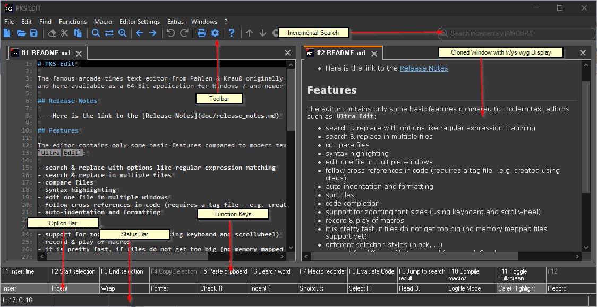

# Using the UI of PKS-Edit

The UI of PKS-Edit typically displays the following areas:

- the `toolbar` gives you access to the most common used editing functions such as copying or pasting text or undo. You
may configure the size of the toolbar buttons or hide them in the [layout settings](configuration.md#layout_options).
- the `incremental search` field can be used to _search as you type_ text in the current editor document. You start incremental
  search by using the configured shortcut (`Ctrl+Alt+S` by default) and return the focus back to the editing window by
  pressing the `Escape` key. To repeat a search in the incremental search fiel press the `Enter` key.
- the `option bar` displays and allows to change the editing options for the active document such as _automatic indenting_ automatic
  wrapping of text (when a maximum number of columns is reached) or the text selection shape. For further details refer to 
  [editing files](editing_files.md#options_affecting_the_editing_of_text).
- the `function keys` display the current editing action bindings to function keys. Holding the `Ctrl`, `Shift` and `Alt` key
  for a while will have the function keys display the action bindings of a function key combined with the pressed control key.
- the `status bar` displays informations about the current editing window such as the current line and column and the dirty 
  state of the current editor window. You may hide and show function key bar, status bar and option bar also using 
  the [layout settings](configuration.md#layout_options).

The `cloned window` on the screenshot is displayed in a different `docking position`. You may clone a window (open a second window to
view the same document edited as in a primary window) by using the menu `File->Clone Window`. Document types which support special
renderer types such as markdown documents will by default switch to special rendering mode in the cloned window (this will allow you
to edit text in the primary window and watch the changes in Wysiwyg display in the cloned window). You may at any time change
the display mode or editing mode of cloned windows - when PKS-Edit is closed and restarted it will preserve the configuration
of document views in the session configuration.

PKS-Edit will manage the editing tabs in up to three `docks`. A default dock, a right dock and a bottom dock.
You may explicitly show a dock using the `Windows->New Horizontal/Vertical Dock` menus. Some actions
such as cloning a window for an editor (displaying an additional window for one file) or such as performing a search in
files will automatically open a dock to place the new window in this dock. You may resize
docks, by dragging the space between docks with the mouse. PKS-Edit saves the sizes and positions of open docks with
its session snapshot saved when exiting to restore the same layout when it is opened the next time.
You may drag tabs from one dock to the other using the mouse to reposition them. Tab titles can be displayed in
a compact mode or in a full-path mode. To change the display of tabs use the [layout settings](configuration.md#layout_options).

